# 2023년 2학기 백엔드 소프트웨어 개발

## 📁 개인 정보

* 이름 : 정종현
* 학번 : 60162176

## 📚 미니 프로젝트

* [채팅 서버 만들기](https://github.com/almond0115/mju-backend-dev/blob/main/chat_server/README.md)

## 📝 과제 정리

* LAB-2 : [IaaS 및 네트워크 개요 (AWS)](https://github.com/almond0115/mju-backend-dev/blob/main/lab2/README.md)

* LAB-3 : [소켓 프로그래밍 #1 (UDP)](https://github.com/almond0115/mju-backend-dev/blob/main/lab3/README.md)

* LAB-4 : [메세지 포맷팅 (Protobuf, JSON)](https://github.com/almond0115/mju-backend-dev/blob/main/lab4/README.md)

* LAB-5 : [소켓 프로그래밍 #2 (TCP)](https://github.com/almond0115/mju-backend-dev/blob/main/lab5/README.md)

* LAB-6 : [멀티쓰레드 프로그래밍](https://github.com/almond0115/mju-backend-dev/blob/main/lab6/README.md)

* LAB-7 : [OAuth 2.0](https://github.com/almond0115/mju-backend-dev/blob/main/lab7/README.md)

* LAB-8 : [Framework - Python Flask](https://github.com/almond0115/mju-backend-dev/blob/main/lab8/README.md)

## 🤔 공부 기록 

* [[11/12] HTTP Status Code](https://github.com/almond0115/mju-backend-dev/blob/main/study/http_status.md)

* [[11/8] Python Flask](https://github.com/almond0115/mju-backend-dev/blob/main/study/pythonFlask.md)

* [[11/5] Web 기반 Framework](https://github.com/almond0115/mju-backend-dev/blob/main/study/framework.md)

* [[11/2] OAuth 2.0](https://github.com/almond0115/mju-backend-dev/blob/main/study/oauth.md) 

* [[10/30] RESTful API](https://github.com/almond0115/mju-backend-dev/blob/main/study/restful_api.md) 

* [[10/26] Producer-Consumer Problem](https://github.com/almond0115/mju-backend-dev/blob/main/study/producer_consumer/README.md)

* [[10/17] Multi Threading](https://github.com/almond0115/mju-backend-dev/blob/main/study/multi_threading.md)

* [[10/15] I/O Multiplexing과 Non-blocking I/O](https://github.com/almond0115/mju-backend-dev/blob/main/study/IO/README.md)

* [[10/13] Socket Options](https://github.com/almond0115/mju-backend-dev/blob/main/study/socket_options.md)

* [[10/13] Nagle's Algorithm](https://github.com/almond0115/mju-backend-dev/blob/main/study/nagle.md)

* [[10/10] Error-related functions and major error codes](https://github.com/almond0115/mju-backend-dev/blob/main/study/error.md)

* [[10/10] Exit Code Convention](https://github.com/almond0115/mju-backend-dev/blob/main/study/return.md)

* [[10/10] Adjust the number of descriptors that can be opened simultaneously](https://github.com/almond0115/mju-backend-dev/blob/main/study/ulimit.md)

* [[10/8] Message Handler](https://github.com/almond0115/mju-backend-dev/blob/main/study/message_handler/README.md)

* [[10/5] 10/4 Quiz Review](https://github.com/almond0115/mju-backend-dev/blob/main/study/quiz/231004.md)

## 📖 개념 시각화
 

   
  <a> &nbsp; 백엔드 프로그래밍 OVERVIEW </a>  

   

   
 <a> &nbsp; Hour Glass </a> 

   

   
 <a>  &nbsp; TCP/IP에서 OSI 모델 적용</a> 

   

   
 <a> &nbsp; 네트워크 간 게이트웨이 이동</a> 

   

   
 <a> &nbsp; DNS Resolution</a> 

   

   
 <a> &nbsp; IP에서 MAC 알아내기 (ARP) </a> 

   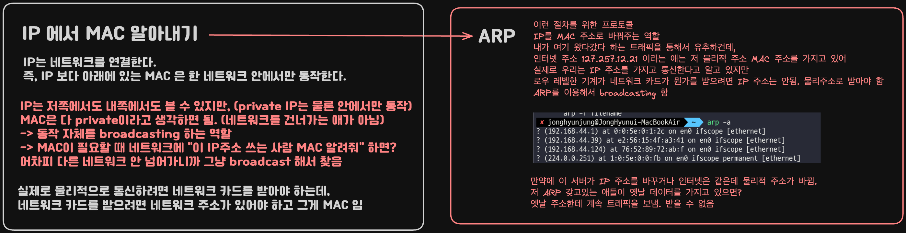

   
 <a> &nbsp; Hypervisor CPU 가상화 </a> 

   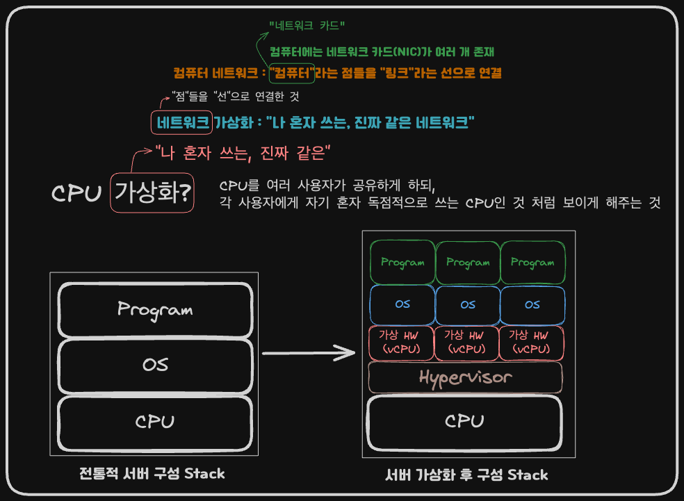

   
 <a> &nbsp; Local DNS </a> 

   

   
 <a> &nbsp; Network Socket Library </a> 

   

   
 <a> &nbsp; UDP / TCP client, server 별 함수 흐름 </a> 

   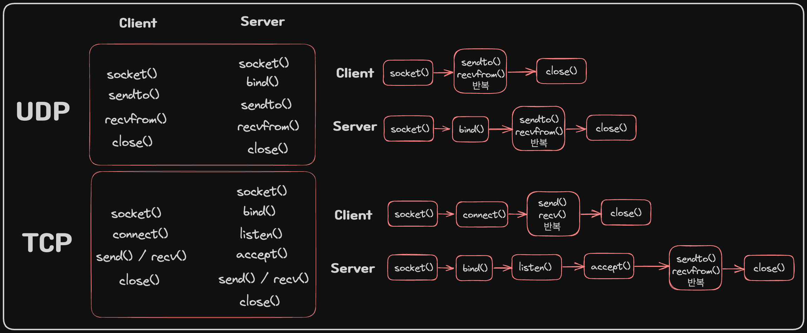

   
 <a> &nbsp; UDP / TCP 네트워크 흐름 </a> 

   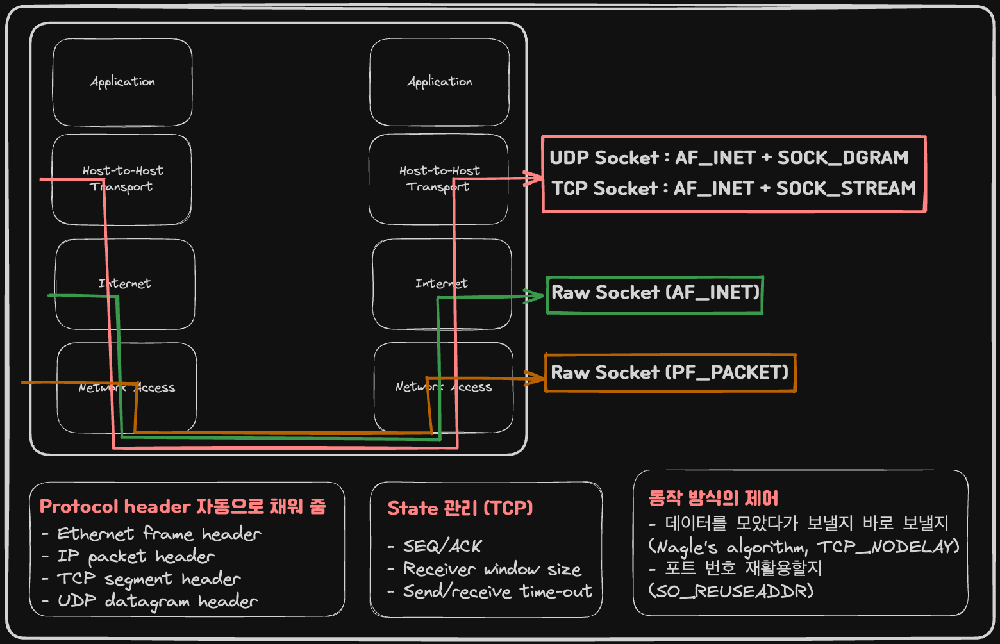

   
 <a> &nbsp; 메세지 포맷팅 </a> 

   

   
 <a> &nbsp; Sendto() 함수의 동작 </a> 

   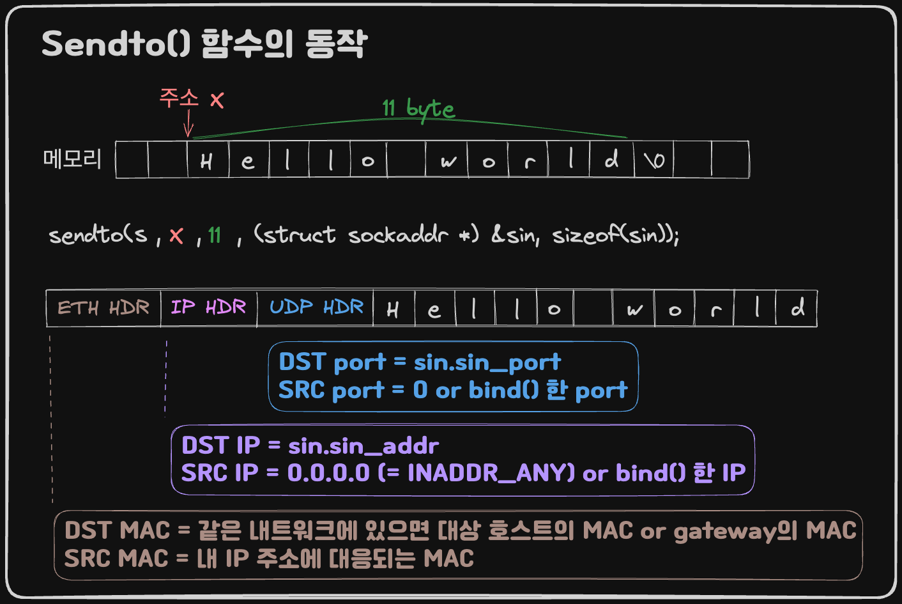

   
 <a> &nbsp; TCP Client, Server 코드 흐름 </a> 

   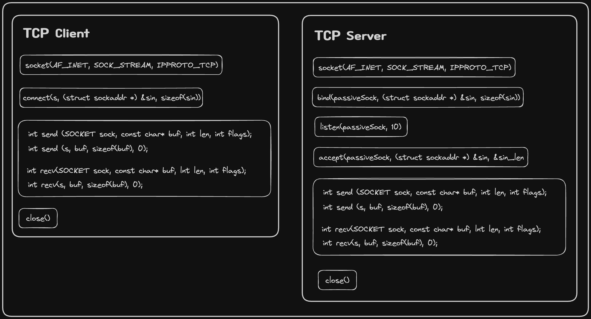

   
 <a> &nbsp; UDP Client, Server 코드 흐름 </a> 

   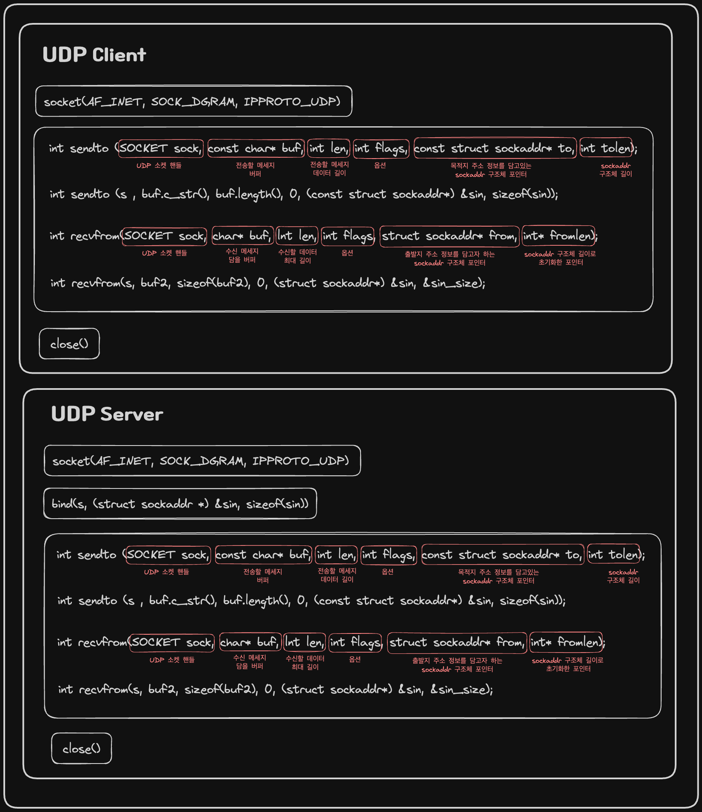

   
 <a> &nbsp; Passive Socket과 Active Socket </a> 

   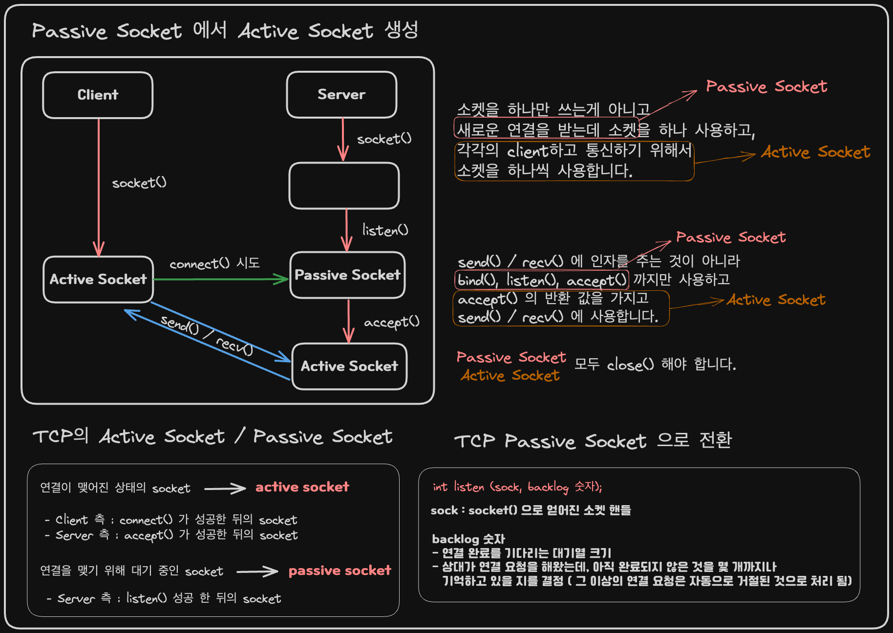

   
 <a> &nbsp; select() 함수 이벤트 종류와 fd_set </a> 

   

   
 <a> &nbsp; Socket Options </a> 

   

   
 <a> &nbsp; TCP, UDP 데이터 전송 </a> 

   

   
 <a> &nbsp; 순차적, 동시성, 병렬성 흐름 </a> 

   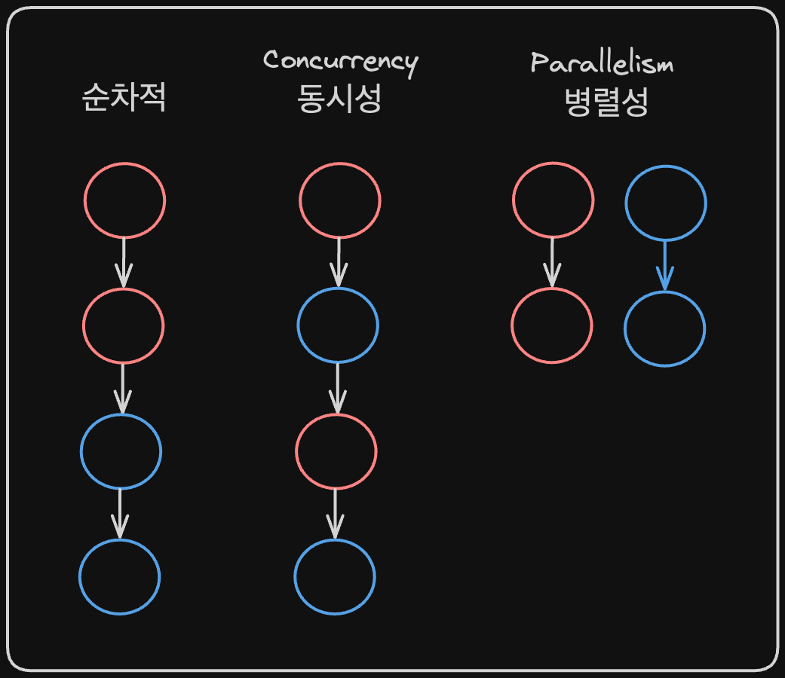

   
 <a> &nbsp; 멀티 태스킹 OS 에서의 Process Life Cycle </a> 

   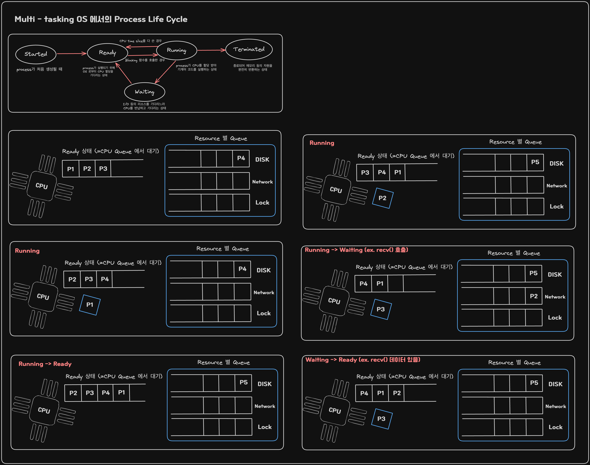

   
 <a> &nbsp; 싱글 쓰레드 vs 멀티 쓰레드 </a> 

   

   
 <a> &nbsp; notify_one() / notify_all() </a> 

   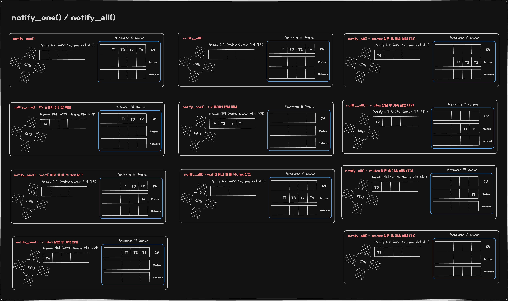

   
 <a> &nbsp; Task Queue + Workers Pool </a> 

   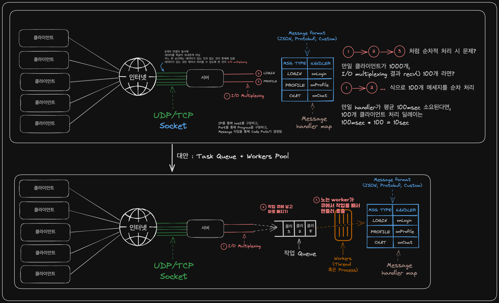

   
 <a> &nbsp; 쓰레드에서 join() 함수</a> 

   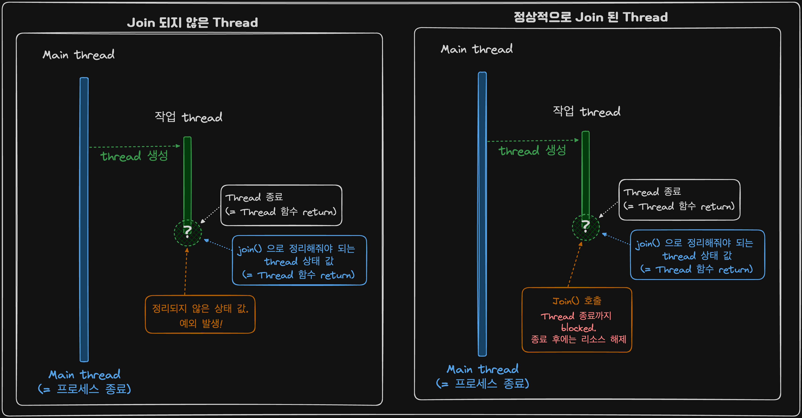

   
 <a> &nbsp; User Level 쓰레드 vs Kernel Level 쓰레드 </a> 

   

